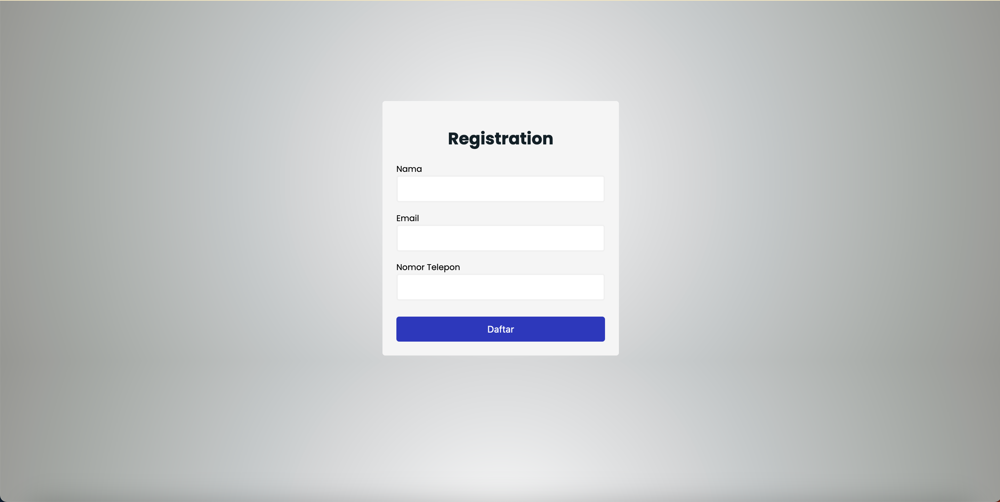

# Dokumentasi Penyelesaian Ujian
Proyek ini ditujukan untuk menjawab beberapa tantangan diantaranya dalam pengembangan frontend, backend, dan *automation testing*. Secara garis besar proyek ini mengenakan beberapa package seperti **express**, **dotenv**, **cors**, **body-parser**, **selenium-webdriver**, dan **chromedriver**.

## Pra-kata instalasi
Terdapat beberapa hal yang harus dilakukan untuk dapat menjalankan proyek ini seperti: 
1. Salin dan tempelkan **environment**  yang berasal dari file *env.example*.
1. Lakukan pengunduhan atas *depedency* yang dibutuhkan dengan command ```npm install```
1. Jalankan proyek melalui daemon node dengan command ```nodemon .```

Seharusnya diterminal akan tertampil seperti ini 
```
[nodemon] 3.0.2
[nodemon] to restart at any time, enter `rs`
[nodemon] watching path(s): *.*
[nodemon] watching extensions: js,mjs,cjs,json
[nodemon] starting `node .`
Express API running in port: 2000
```
> [!NOTE]
> Tested on node v20.10.0


## Pengembangan FrontEnd
Diselesaikan sebagaimana yang diminta pada soal dengan HTML, CSS, dan Javascript. Dimana terdapat tiga buah *form field data* yang nantinya akan dikirim kan menuju *endpoint* yang telah dibuat. Terdapat beberapa validasi yang diterapkan seperti validasi atas *field* yang kosong untuk semuanya, pengecekan melalui *regex* atas *email field* yang dikirimkan apakah sesuai dengan format *email* sebagaimana mestinya, dan pengecekan *regex* atas nomor telepon yang disesuaikan dengan format Indonesia. Disamping itu juga mengembalikan hasil dari validasi berupa pesan *setError* apabila terjadi *malfunction* atas *field* tersebut dan sebaliknya mengembalikan hasil *setSuccess* apabila lolos validasi dan dapat diteruskan proses *convert* dari text menjadi **JSON** yang kemudian *binding data* atas *endpoint* yang telah disiapkan untuk menyimpan data tersebut. 

Untuk menampilkan tampilan form dikarenakan disatukan dalam serve Node JS ini maka dapat diakses pada endpoint ```{BASE_URL}/register``` serta memiliki tampilan sebagai berikut:



## Pengembangan BackEnd
Diselesaikan dengan mengenakan **NodeJS** *framework* **Express** yang mana menerapkan **Clean Architecture** dengan prinsip *Separation of Concerns* **(SOC)**. Yang mana *software program* terbagi menjadi beberapa segmentasi dengan penerapan memisahkan antara logika *routing*, *domain* untuk store data, dan *controllers* sebagai logika pemrograman. 

    ├── controllers               # pengolahan logika pemrograman utama 
    ├── domain                    # kumpulan tipe data 
    ├── public                    # front end sources
    ├── routes                    # routing atas endpoint API
    └── README.md
Terdapat dua buah endpoint yang dikerjakan diantaranya:
- ```{BASE_URL}/v1/register``` dengan *method* **GET** yang mana memiliki contoh response sebagai berikut 
    ```
    {
        "success": true,
        "code": 200,
        "message": "Success retrieve all data",
        "data": [
            {
                "nama": "abi",
                "email": "abi@gmail.com",
                "mobile_number": "081219527575"
            },
            {
                "nama": "hilmi",
                "email": "hilmi@gmail.com",
                "mobile_number": "+6281230480221"
            }
        ]
    }
    ```

- ```{BASE_URL}/v1/register``` dengan *method* **POST** yang mana memiliki form body data seperti ini
    ```
    {
        "nama": "hilmi",
        "email": "hilmi@gmail.com",
        "mobile_number": "+6281230480221"
    }
    ```
    dan akan mendapatkan response sebagai berikut
    ```
    {
        "success": true,
        "code": 201,
        "message": "User registration was successful",
        "data": {
            "nama": "hilmi",
            "email": "hilmi@gmail.com",
            "mobile_number": "+6281230480221"
        }
    }
    ```


## Pengujian Otomasi *(Automation Testing)*
Penyelesaian untuk *section* ini dengan skrip otomatis **Sleenium** dimana pada prinsipnya program yang dibuat pada ```index-test.js``` akan melakukan pengujian secara *end-to-end* terhadap form registrasi. **Selenium** nantinya akan melakukan pengujian secara *Integrated Development Environment* **(IDE)** atas browser *Google Chrome* dengan mengisikan atas *field*-*field* seperti **nama**, **email**, dan **mobile_number**. Dengan mengharapkan *return value* atas validasi dari **Pengembangan FrontEnd** berupa *class css* ketika *success* maka pengujian pun selesai. 